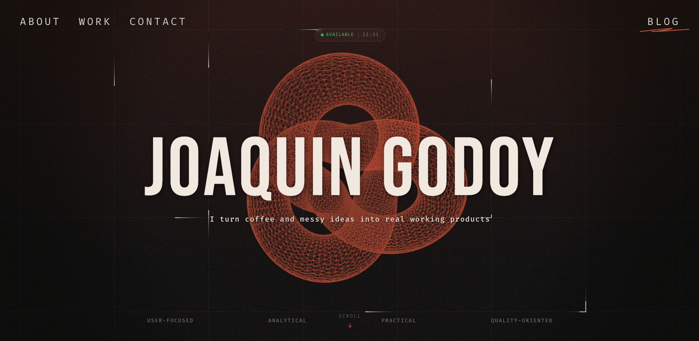

<div align="center">

# Joaquín Godoy

[](https://joaquingodoy.com)


[](https://github.com/JoaccoG/portfolio/actions/workflows/build.yaml)
[](https://github.com/JoaccoG/portfolio/actions/workflows/test.yaml)
[](https://github.com/JoaccoG/portfolio/actions/workflows/audit.yaml)
[](LICENSE)

<br />

<div align="center">
  <a href="#features">Features</a> ·
  <a href="#getting-started">Getting Started</a> ·
  <a href="#architecture">Architecture</a> ·
  <a href="#structure">Structure</a> ·
  <a href="#infrastructure">Infrastructure</a> ·
  <a href="#api-reference">API</a> ·
  <a href="#license">License</a>
</div>

<div align="center">
  
</div>

</div>

<br />

A professional portfolio for [Joaquín Godoy](https://joaquingodoy.com) — Software Engineer. The site is built as an
immersive, dark-themed experience with a WebGL overlay system (vignette, film grain, animated orb grid), a 3D hero
scene, scroll-driven GSAP animations, and a serverless backend for contact forms and newsletter subscriptions.

> _"I turn coffee and messy ideas into real working products"_

<br />

## Features

| Area                  | Highlights                                                                                                                                                       |
| --------------------- | ---------------------------------------------------------------------------------------------------------------------------------------------------------------- |
| **3D Hero Scene**     | Interactive torus knot mesh rendered with React Three Fiber, mouse-driven rotation, `Float` animation from drei                                                  |
| **WebGL Overlay**     | Full-viewport orthographic canvas with four composable layers: vignette, film grain, animated grid, and orb particle system — all powered by custom GLSL shaders |
| **Scroll Animations** | GSAP ScrollTrigger with pinned sections, scrubbed timelines, staggered entrances, and `matchMedia` for desktop/mobile variants                                   |
| **Smooth Scrolling**  | Lenis integration synced with GSAP's ticker for buttery inertia-based scrolling, with auto-pause during form focus                                               |
| **Responsive System** | Custom `useBreakpoint` hook with a `resolve()` overload for declarative per-breakpoint style values — no CSS media queries in JS                                 |
| **Contact API**       | Netlify serverless function → Resend email delivery, rate limiting (5/min/IP), Valibot schema validation                                                         |
| **Newsletter**        | Blog "Coming Soon" modal → subscriber signup via Resend Audiences, duplicate detection (409), focus-trapped accessible modal                                     |
| **Analytics**         | Umami privacy-first analytics with async script loading, event queue for pre-load tracking, sanitized payloads                                                   |
| **Accessibility**     | Focus traps, `aria-*` attributes, keyboard navigation, `role="dialog"`, focus restoration, semantic elements                                                     |
| **Icon Pipeline**     | SVG → React component generation via SVGR with a `build:icons` script, centralized through a single `SvgIcon` component                                          |
| **CI/CD**             | GitHub Actions for linting, testing, SonarQube analysis, and automated Netlify deploys                                                                           |
| **Git Hooks**         | Husky with conventional commit validation, lint-staged, pre-push type-check + tests, branch naming enforcement                                                   |

<br />

## Getting Started

### Prerequisites

| Tool                          | Version |
| ----------------------------- | ------- |
| [Node.js](https://nodejs.org) | 22.x    |
| [pnpm](https://pnpm.io)       | 10.30+  |

### Installation

```bash
# Clone the repository
git clone https://github.com/joaquingodoy/portfolio.git

# Navigate to the project directory
cd portfolio

# Install dependencies
pnpm install

# Copy the example environment variables file and edit it to your needs
cp .env.example .env
```

### Environment Variables

| Variable              | Required | Description                            |
| --------------------- | -------- | -------------------------------------- |
| `ENVIRONMENT`         | Yes      | `local` / `production`                 |
| `EMAILS__FROM`        | Server   | Sender email address (Resend verified) |
| `EMAILS__RECIPIENT`   | Server   | Recipient for contact form emails      |
| `LINKS__EMAIL`        | Yes      | Public email address                   |
| `LINKS__GITHUB`       | Yes      | GitHub profile URL                     |
| `LINKS__LINKEDIN`     | Yes      | LinkedIn profile URL                   |
| `LINKS__X`            | Yes      | X (Twitter) profile URL                |
| `LINKS__INSTAGRAM`    | Yes      | Instagram profile URL                  |
| `LINKS__SPOTIFY`      | Yes      | Spotify profile URL                    |
| `UMAMI__SCRIPT_URL`   | Prod     | Umami analytics script URL             |
| `UMAMI__WEBSITE_ID`   | Prod     | Umami website ID                       |
| `RESEND__API_KEY`     | Server   | Resend API key                         |
| `RESEND__AUDIENCE_ID` | Server   | Resend audience ID for newsletter      |

> Client-side variables are injected at build time via Vite's `define` config, no `VITE_` prefix needed.

### Running Locally

```bash
# Frontend only (available at port :5173)
pnpm dev

# Frontend + Serverless Functions (available at port :8888)
pnpm dev:server
```

<br />

## Architecture

### High-Level Overview

```
┌─────────────────────────────────────────────────────────────────────┐
│                               Browser                               │
│                                                                     │
│   ┌─────────────────────────────────────────────────────────────┐   │
│   │                    WebGL Overlay (z: -1)                    │   │
│   │   ┌──────────┐ ┌──────────┐ ┌──────────┐ ┌──────────────┐   │   │
│   │   │ Vignette │ │  Grain   │ │   Grid   │ │  Orb System  │   │   │
│   │   │  (GLSL)  │ │  (GLSL)  │ │ (points) │ │ (simulation) │   │   │
│   │   └──────────┘ └──────────┘ └──────────┘ └──────────────┘   │   │
│   └─────────────────────────────────────────────────────────────┘   │
│                                                                     │
│   ┌─────────────────────────────────────────────────────────────┐   │
│   │                       React App (z: 0)                      │   │
│   │                                                             │   │
│   │    ┌─ Header ─── About ─── Work ─── Contact ─── Blog ──┐    │   │
│   │    │                                                   │    │   │
│   │    └── Lenis smooth scroll (synced with GSAP ticker) ──┘    │   │
│   │                                                             │   │
│   │       ┌────────┐ ┌────────┐  ┌──────────┐ ┌─────────┐       │   │
│   │       │  Hero  │ │ About  │  │ Projects │ │ Contact │       │   │
│   │       │ + R3F  │ │ + GSAP │  │ + GSAP   │ │ + API   │       │   │
│   │       │ Canvas │ │ scroll │  │ spotlight│ │ + form  │       │   │
│   │       └────────┘ └────────┘  └──────────┘ └─────────┘       │   │
│   │                                                             │   │
│   │       Footer ─── Newsletter Modal ─── SvgIcon system        │   │
│   └─────────────────────────────────────────────────────────────┘   │
└─────────────────────────────────────────────────────────────────────┘
                                   │
                           HTTPS (.../api/*)
                                   │
                                   ▼
┌─────────────────────────────────────────────────────────────────────┐
│                      Netlify Edge (Serverless)                      │
│                                                                     │
│   ┌────────────────────────┐           ┌────────────────────────┐   │
│   │   /api/contact         │           │   /api/subscribers     │   │
│   │   Rate limit: 5/min    │           │   Rate limit: 3/min    │   │
│   │   Valibot validation   │           │   Valibot validation   │   │
│   └───────────┬────────────┘           └────────────┬───────────┘   │
│               │                                     │               │
│               ▼                                     ▼               │
│   ┌─────────────────────────────────────────────────────────────┐   │
│   │                         Resend SDK                          │   │
│   │    emails.send()             │         contacts.create()    │   │
│   └─────────────────────────────────────────────────────────────┘   │
└─────────────────────────────────────────────────────────────────────┘
```

### Shader Pipeline

```
src/shaders/overlay/
├── fullscreen.vert    ← Shared vertex shader for fullscreen quad passes
├── vignette.frag      ← Radial darkening from screen edges
├── grain.frag         ← Film grain with LCG pseudo-random generator
├── orb.vert           ← Per-particle vertex positioning
└── orb.frag           ← Orb rendering with soft falloff
```

Each shader layer is composited in a fixed orthographic R3F `Canvas` behind the main DOM content (`z-index: -1`,
`pointer-events: none`), creating a cohesive visual atmosphere without impacting interactivity.

<br />

## Structure

```
portfolio/
├── .github/
│   └── workflows/             # CI pipelines
├── .husky/                    # Git hooks
├── docs/
│   ├── assets/                # Documentation assets
│   └── release/               # Release notes per version
├── netlify/
│   ├── functions/             # Serverless API endpoints
│   ├── lib/                   # Shared backend logic
│   └── middlewares/           # Request pipeline
├── public/
│   ├── assets/
│   │   └── icons/             # Source SVGs for the icon generation pipeline
│   └── files/                 # Publicly downloadable files
├── scripts/                   # Project build scripts and automation
└── src/
    ├── components/            # Shared UI
    │   └── Overlay/           # WebGL overlay system
    ├── constants/             # Content copy, nav config, overlay tuning values
    ├── hooks/                 # Global hooks
    ├── lib/                   # Shared logic
    ├── pages/                 # Pages & sections (each can contain components, hooks, utils, etc. inside them)
    ├── shaders/               # GLSL vertex & fragment shaders
    ├── style/                 # Global CSS variables, resets, typography, keyframes
    └── test/                  # Shared test utilities and helpers
```

<br />

## Infrastructure

### Hosting & Deployment

The site is deployed on **Netlify** with automatic deploys triggered on every push to `main`.

| Setting             | Value                                                           |
| ------------------- | --------------------------------------------------------------- |
| Build command       | `pnpm install --frozen-lockfile --ignore-scripts && pnpm build` |
| Publish directory   | `dist/`                                                         |
| Functions directory | `netlify/functions/`                                            |
| Node.js             | 22.21.1                                                         |
| pnpm                | 10.30.0                                                         |
| SPA fallback        | `/* → /index.html` (200)                                        |

### Serverless Functions

API endpoints run as Netlify Functions (AWS Lambda under the hood) with a shared middleware pipeline:

```
Request → withApi() → withErrorHandler() → handler → JSON response
```

- **Rate limiting** — Per-IP, per-endpoint (5/min for contact, 3/min for subscribers)
- **Validation** — Valibot schemas applied before hitting any business logic
- **Error handling** — `ApiError` class with structured JSON error responses and status codes
- **Email delivery** — Resend SDK singleton with daily quota detection (429) and time-until-reset messages

### CI/CD

Three GitHub Actions workflows run on every pull request and push to `main`:

| Workflow       | File         | Purpose                                |
| -------------- | ------------ | -------------------------------------- |
| **Code Audit** | `audit.yaml` | Runs ESLint and Prettier               |
| **Testing**    | `test.yaml`  | Runs the full Vitest suite             |
| **SonarQube**  | `build.yaml` | Builds the app and runs SonarQube scan |

**Git hooks** are enforced locally via Husky:

| Hook         | Behavior                                                                           |
| ------------ | ---------------------------------------------------------------------------------- |
| `commit-msg` | Validates conventional commit format (feat, fix, refactor, etc.), 8–120 char limit |
| `pre-commit` | Blocks `debugger` statements in staged files, runs lint-staged (ESLint + Prettier) |
| `pre-push`   | Enforces branch naming (`feature/*` or `bug/*`), runs full build + tests           |

### SEO & Crawling

- `robots.txt` — Allows indexing of `/`, blocks `/api/`, `/_next/`, `/.netlify/`, and common AI/scraper bots
- `sitemap.xml` — Single-URL sitemap at `https://joaquingodoy.com/`
- `index.html` — `meta description`, `keywords`, `author`, `color-scheme`, Open Graph–ready

### Analytics

**Umami** (privacy-first, cookieless) with:

- Async script injection (production only)
- Event queue that buffers `track()` calls before the script loads
- Sanitized payloads — no raw user content is sent to analytics

### Security

- `.npmrc` with npm supply chain protections
- Environment variables split between client (build-time `define`) and server (`process.env`) — no secrets leak to the
  bundle
- Rate limiting on all public API endpoints
- ReDoS-safe email regex in all validation paths

<br />

## API

### `POST /api/contact`

Send an email from the contact form.

```json
{
  "email": "user@example.com",
  "subject": "Optional subject",
  "message": "Hello!"
}
```

| Status | Description                                                     |
| ------ | --------------------------------------------------------------- |
| `200`  | Email sent successfully                                         |
| `400`  | Validation error (missing/invalid fields)                       |
| `429`  | Rate limited (5 requests/min/IP) or Resend daily quota exceeded |
| `500`  | Internal server error                                           |

### `POST /api/subscribers`

Subscribe to the blog newsletter.

```json
{
  "email": "user@example.com"
}
```

| Status | Description                      |
| ------ | -------------------------------- |
| `201`  | Subscriber added                 |
| `400`  | Validation error                 |
| `409`  | Email already subscribed         |
| `429`  | Rate limited (3 requests/min/IP) |
| `500`  | Internal server error            |

<br />

## License

Distributed under the **MIT License**. See [`LICENSE`](LICENSE) for details.

<br />

<div align="center">

---

**Built by [Joaquín Godoy](https://joaquingodoy.com)**

</div>
